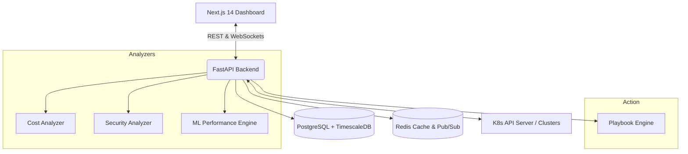

# Architecture

k8s-inspector 2.0 is built on a modern, decoupled architecture designed for scale and real-time observability.

## High-Level Design

## Core Components

### 1. Frontend (Next.js 14)
* **Framework:** React / Next.js (App Router)
* **Styling:** Tailwind CSS + shadcn/ui
* **Real-time:** WebSockets for live cluster telemetry

### 2. Backend (FastAPI)
* **Framework:** Python / FastAPI (Async)
* **Cluster Comm:** Official `kubernetes` and `openshift` Python clients.
* **Concurrency:** `asyncio` for high-throughput cluster polling.

### 3. Database Layer
* **PostgreSQL:** Stores relational data (Clusters, Insights, Playbooks).
* **TimescaleDB:** Extension for high-performance time-series metric storage.
* **Redis:** Session caching and WebSocket Pub/Sub broadcasting.

### 4. Engines
* **Analyzers:** Dedicated modules for Cost, Security, and ML/Performance.
* **Playbook Service:** Parses YAML files and executes corrective Kubernetes API calls.
